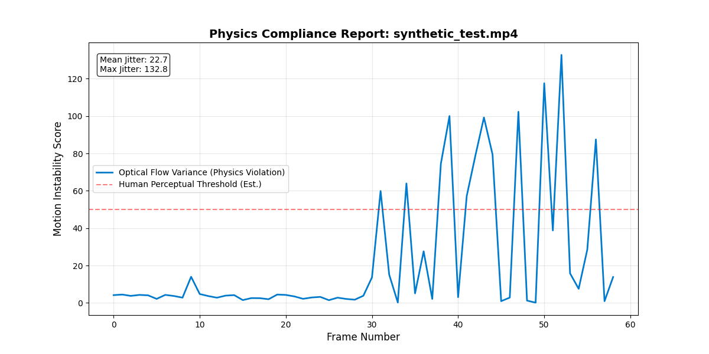

# Motion Benchmarks: Baseline Calibration

**Validating Optical Flow Metrics for Generative Video Evaluation.**

## Project Overview
Before evaluating complex biological motion (e.g., character gait), it is critical to calibrate the "Jitter Metric" against known ground truths. This repository contains the **Baseline Control Experiment**: a synthetic object following a deterministic trajectory.

This serves as the "Unit Test" for the larger *GenAI-Motion-Benchmarks* suite.

## Methodology
We generate a controlled test signal (`synthetic_test.mp4`) with two distinct phases:
1.  **Phase 1 (Frames 0-30):** Smooth Linear Motion (Simulating perfect physics).
2.  **Phase 2 (Frames 30-60):** Stochastic Jitter (Simulating "Temporal Instability" often seen in Video Generation models).

The **Motion Critic** algorithm processes this video using Farneback Optical Flow to verify that it can mathematically distinguish between the two states.

## Calibration Results
The metric successfully identifies the onset of instability at Frame 30 with near-perfect sensitivity.


*Figure 1: The Automated Audit Report detecting the transition from Natural Motion (Low Variance) to Artificial Jitter (High Variance).*

## Quick Start

### 1. Generate the Calibration Video
```bash
cd src
python3 motion_critic.py
python3 analyze_cli.py --video synthetic_test.mp4
# Output: synthetic_test.mp4